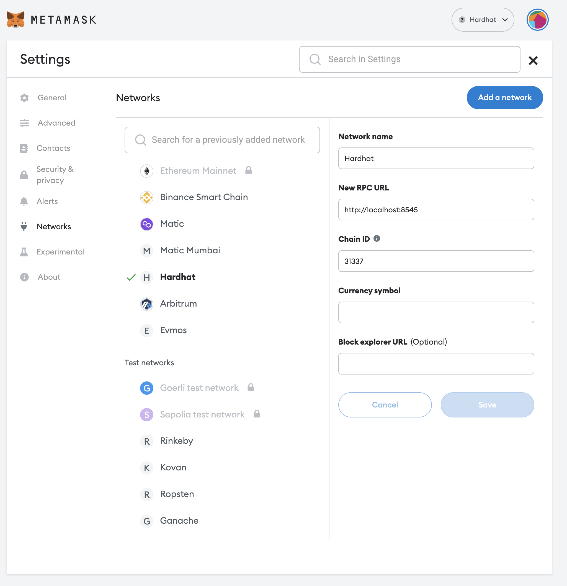
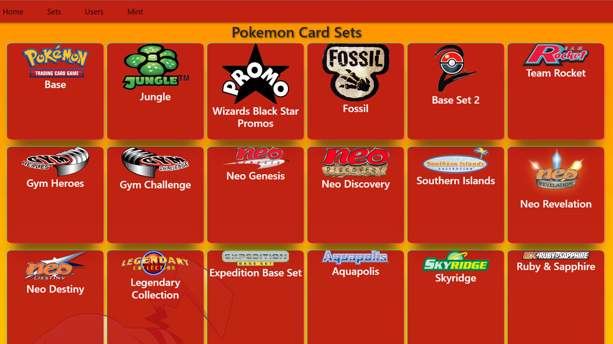
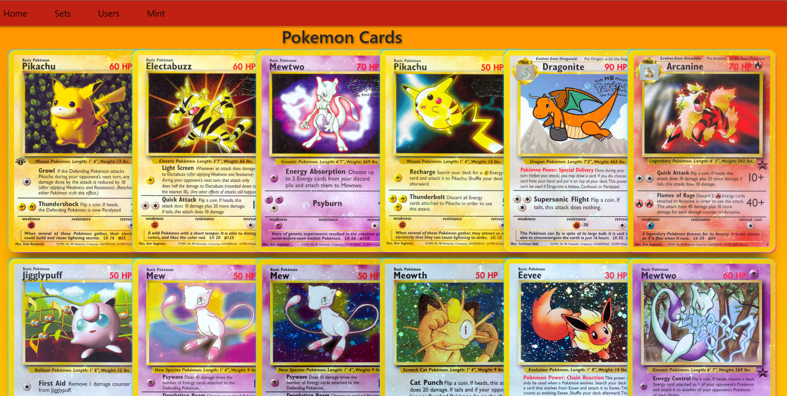
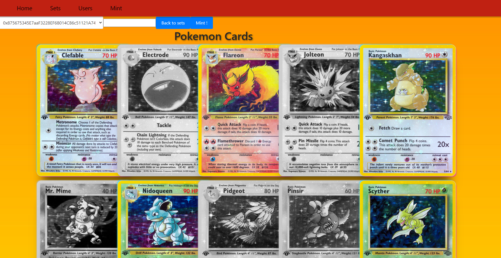

# Collectible Card Game

Welcome to the DAAR project. The idea will be to implement a Collectible Card Game
in a decentralized way, on Ethereum. This will force you to iterate through the creation
of CCG cards as NFT, create a marketplace for players to exchange NFT, and run a frontend to create collections.


# Installation


You’ll need to install dependencies. You’ll need [`HardHat`](https://hardhat.org/), [`Node.js`](https://nodejs.org/en/), [`NPM`](https://www.npmjs.com/) and [`Yarn`](https://yarnpkg.com/). You’ll need to install [`Metamask`](https://metamask.io/) as well to communicate with your blockchain.

- `HardHat` is a local blockchain development, to iterate quickly and avoiding wasting Ether during development. Fortunately, you have nothing to do to install it.
- `Node.js` is used to build the frontend and running `truffle`, which is a utility to deploy contracts.
- `NPM` or `Yarn` is a package manager, to install dependencies for your frontend development. Yarn is recommended.
- `Metamask` is a in-browser utility to interact with decentralized applications.

# Some setup

Once everything is installed, launch the project (with `yarn dev`). You should have a local blockchain running in local. Open Metamask, setup it, and add an account from the Private Keys HardHat displays.
Now you can connect Metamask to the blockchain. To do this, add a network by clicking on `Ethereum Mainnet` and `personalized RPC`. Here, you should be able to add a network.



Once you have done it, you’re connected to the HardHat blockchain!

# Installation

Install the dependencies.

```bash
# Yarn users
yarn
```

Run the complete project.

```bash
# Yarn users
yarn dev
```

You’re good to go!

---
# Photos of the application





> Implement at least one feature.

- Improve the frontend, by adding a way to manage collection, like a binder.
- Improve the contract, to be able to manage a multichain codebase, with a bridge between chains.
- Add a game engine for the cards, like fighting with your Pokémon and some energy cards.
- Implement a marketplace to exchange cards between users.
- Implement a tournament game some promos cards for winners.
